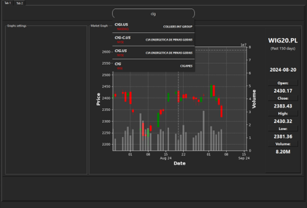

# Financial Market Analysis and Prediction Tool - README

## Overview

This application is a comprehensive tool for financial market analysis and prediction, leveraging machine learning algorithms and technical indicators. It allows users to acquire financial data, compute market indicators, and utilize machine learning models to predict market movements.

## Features

- **Data Acquisition**: Fetches OHLCV (Open, High, Low, Close, Volume) data from various online sources.
- **Technical Indicators Calculation**: Computes various technical indicators (e.g., Bollinger Bands, MACD, RSI) using TA-Lib and other advanced libraries.
- **Machine Learning Models**: Implements machine learning models (such as LSTM) to forecast market trends and prices.
- **Integrated Workflow**: Combines data acquisition, indicator calculation, and machine learning prediction into a unified analysis pipeline.

## Components

1. **`data_acquisition.py`**:
   - Fetches market data such as stock prices (OHLCV) from different sources.
   - Processes and saves the data for further analysis.
   - Provides utility functions to handle data, such as `create_ticker_name_dict(filepath)` to create dictionaries from ticker names.

2. **`market_indicators.py`**:
   - Uses TA-Lib and custom methods to compute market indicators like Bollinger Bands, MACD, RSI, etc.
   - Prepares dataframes by merging OHLCV data with computed indicators for use in machine learning models.

3. **`ml_funcs.py`**:
   - Contains functions for machine learning, specifically for building and training LSTM models using Keras and TensorFlow.
   - Includes data preprocessing functions, such as data scaling using `StandardScaler`.

4. **`ML_Model.py`**:
   - Integrates functions from other scripts to create a unified market analysis and prediction workflow.
   - Handles data preparation, indicator computation, and model training/prediction.

## App GUI:
